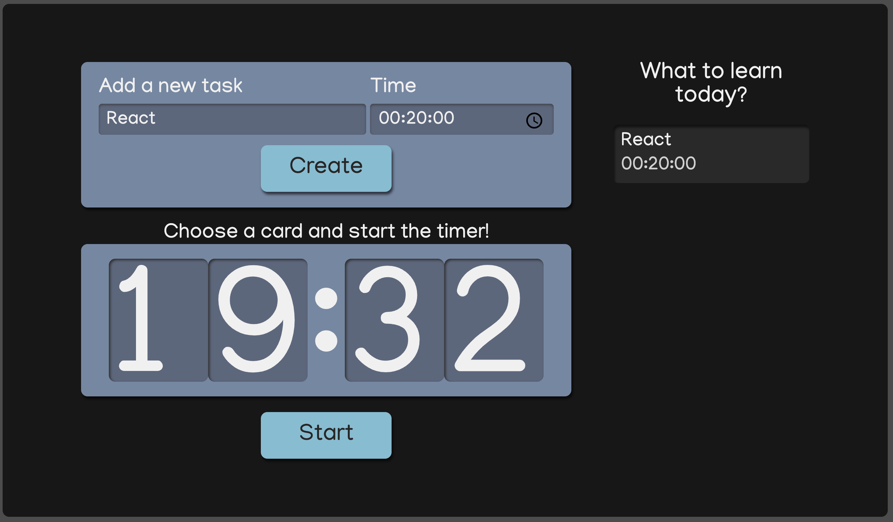

# Task Timer ReactJS Project

A simple React-based application designed to help users track and manage tasks with a built-in timer. Users can create tasks, set time limits, and track time spent on each task, with the option to mark tasks as completed.

## Features

- **Task Creation:** Add new tasks with descriptions and time limits.
- **Time Tracking:** Track time spent on each task with a countdown timer.
- **Task List:** View, select, and mark tasks as completed.
- **Responsive Layout:** Optimized for mobile and desktop devices.
- **Interactive Button Styles:** Customizable buttons with active states.

## Screenshot



## Installation

1. Clone the repository:
   ```bash
   git clone https://github.com/sarahcalbez/task_timer_react.git

2.	Navigate to the project folder:

    ```bash
    cd task-timer-react-app
3.	Install dependencies:
    ```bash
    yarn install
4.	Start the development server:
    ```bash
    yarn dev


## Technologies Used

-  **React:** A JavaScript library for building user interfaces.
-  **CSS Modules:** Scoped styling for components.
-  **TypeScript:** Strongly typed JavaScript for better tooling and error checking.
-  **uuid:** For generating unique task IDs.
-  **Date-fns:** For date and time manipulation.
-  **Responsive Design:** Optimized for both desktop and mobile devices.

## Contributing

1. Fork the repository.
2. Create your feature branch (`git checkout -b feature-name`).
3. Commit your changes (`git commit -am 'Add new feature'`).
4. Push to the branch (`git push origin feature-name`).
5. Create a new Pull Request.

## License

This project is available for free access and use for educational purposes.
